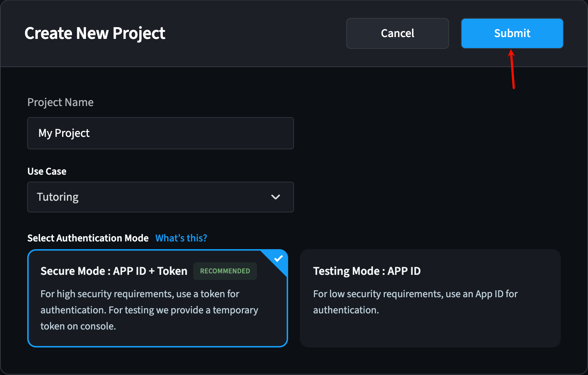
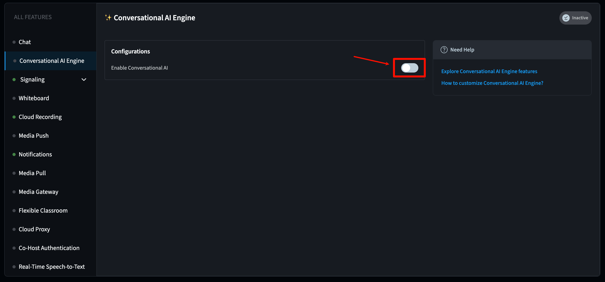

# Conversational AI Engine Service

English | [简体中文](./README_ZH.md)

## Service Overview

Agora's Conversational AI Engine redefines human-computer interaction, breaking through traditional text interactions to achieve highly realistic, natural, and smooth real-time voice conversations, allowing AI to truly "speak." It is suitable for innovative scenarios such as intelligent assistants, emotional companionship, spoken language training, intelligent customer service, smart hardware, and immersive game NPCs.

## Environment Setup

- Obtain Agora App ID -------- [Agora Console](https://console.agora.io/v2)

  > - Click Create Application
  >
  >   
  >
  > - Select the type of application you want to create
  >
  >   

- Obtain App Certificate ----- [Agora Console](https://console.agora.io/v2)

  > In the project management page of the Agora Console, find your project and click Configure.
  > 
  > Click the copy icon under Primary Certificate to obtain the App Certificate for your project.
  > 

- Enable Conversational AI Engine Service ----- [Enable Service](https://docs.agora.io/en/conversational-ai/get-started/manage-agora-account)
  > 


## API Definition

For more api details, please refer to the [API Documentation](https://docs.agora.io/en/conversational-ai/rest-api/join)

## API Call Examples

### Initialize Conversational AI Engine Client

```java
    public static final String APP_ID = "<your appId>";
    public static final String CNAME = "<your cname>";
    public static final String USERNAME = "<the username of basic auth credential>";
    public static final String PASSWORD = "<the password of basic auth credential>";

	Credential credential = new BasicAuthCredential(USERNAME, PASSWORD);
        ConvoAIConfig config = ConvoAIConfig.builder().
                appId(APP_ID).
                credential(credential).
                // Specify the region where the server is located. Options include CN, EU, AP, US.
                // The client will automatically switch to use the best domain based on the configured region.
                domainArea(DomainArea.CN).
                // Specify the service region. Options include ChineseMainlandServiceRegion, GlobalServiceRegion.
                // ChineseMainlandServiceRegion and GlobalServiceRegion are two different services.
                serverRegion(ConvoAIServiceRegionEnum.CHINESE_MAINLAND).
                build();

    ConvoAIClient convoAIClient = ConvoAIClient.create(config);
```

### Create Conversational Agent
>
> Create a Conversational AI agent instance and join an RTC channel.

Parameters to set: LLM, TTS, and Agent related parameters.

Call the `join` method to create a conversational agent, using Bytedance TTS as an example:

```java
    public static final String AGENT_RTC_UID = "<your agent rtc uid>";
    public static final String AGENT_RTC_TOKEN = "<your agent rtc token>";

    public static final String LLM_URL = "<your llm url>";
    public static final String LLM_API_KEY = "<your llm api key>";
    public static final String LLM_MODEL = "<your llm model>";

    public static final String TTS_BYTEDANCE_TOKEN = "<your bytedance tts token>";
    public static final String TTS_BYTEDANCE_APP_ID = "<your bytedance tts app id>";
    public static final String TTS_BYTEDANCE_CLUSTER = "<your bytedance tts cluster>";
    public static final String TTS_BYTEDANCE_VOICE_TYPE = "<your bytedance tts voice type>";

	// Start agent
    String name = APP_ID + ":" + CNAME;

    JoinConvoAIRes joinConvoAIRes;
    try {
        joinConvoAIRes = convoAIClient.join(JoinConvoAIReq.builder()
                    .name(name)
                    .properties(JoinConvoAIReq.Properties.builder()
                            .token(AGENT_RTC_TOKEN)
                            .channel(CNAME)
                            .agentRtcUId(AGENT_RTC_UID)
                            .remoteRtcUIds(new ArrayList<String>() {
                                {
                                    add("*");
                                }
                            })
                            .enableStringUId(false)
                            .idleTimeout(120)
                            .advancedFeatures(JoinConvoAIReq.AdvancedFeatures.builder()
                                    .enableAIVad(true)
                                    .build())
                            .llmPayload(JoinConvoAIReq.LLMPayload.builder()
                                    .url(LLM_URL)
                                    .apiKey(LLM_API_KEY)
                                    .params(new HashMap<String, Object>() {
                                        {
                                            put("model", LLM_MODEL);
                                            put("max_tokens", 1024);
                                            put("username", "Jack");
                                        }
                                    })
                                    .systemMessages(new ArrayList<Map<String, Object>>() {
                                        {
                                            add(new HashMap<String, Object>() {
                                                {
                                                    put("content", "You are a helpful chatbot。");
                                                    put("role", "system");
                                                }
                                            });
                                        }
                                    })
                                    .maxHistory(30)
                                    .greetingMessage("Hello,how can I help you?")
                                    .build())
                            .ttsPayload(JoinConvoAIReq.TTSPayload.builder()
                                    .vendor(JoinConvoAIReq.TTSVendorEnum.BYTEDANCE)
                                    .params(JoinConvoAIReq.BytedanceTTSVendorParams.builder().
                                            token(TTS_BYTEDANCE_TOKEN).
                                            cluster(TTS_BYTEDANCE_CLUSTER).
                                            voiceType(TTS_BYTEDANCE_VOICE_TYPE).
                                            appId(TTS_BYTEDANCE_APP_ID).
                                            speedRatio(1.0F).
                                            volumeRatio(1.0F).
                                            pitchRatio(1.0F).
                                            emotion("happy").
                                            build())
                                    .build())
                            .vadPayload(JoinConvoAIReq.VADPayload.builder()
                                    .interruptDurationMs(160)
                                    .prefixPaddingMs(300)
                                    .silenceDurationMs(480)
                                    .threshold(0.5F)
                                    .build())
                            .asrPayload(JoinConvoAIReq.ASRPayload.builder()
                                    .language("zh-CN")
                                    .build())
                            .build())
                    .build()).block();
        } catch (AgoraException e) {
            logger.error("Failed to start the agent,err:{}", e.getMessage());
            return;
        } catch (Exception e) {
            logger.error("Unknown exception,err:{}", e.getMessage());
            return;
        }

    if (joinConvoAIRes == null) {
        System.out.println("Failed to start the agent");
        return;
    }

    logger.info("Start the agent successfully, joinConvoAIRes:{}", joinConvoAIRes);

```

### Stop Conversational Agent

> Stop the conversational agent and leave the RTC channel.

Parameters to set:
- AgentId returned by the `join` interface

```java
 // Stop the agent
    try {
        convoAIClient.leave(agentId).block();
        logger.info("Leave the agent successfully, agentId:{}", agentId);
    } catch (AgoraException e) {
        logger.error("Failed to leave the agent,err:{}", e.getMessage());
    } catch (Exception e) {
        logger.error("Unknown exception,err:{}", e.getMessage());
    }
```

### Update Agent Configuration

> Currently, only the Token information of a running conversational agent can be updated.

Parameters to set:
- AgentId returned by the `join` interface
- Token to be updated

```java
    // Update agent
    UpdateConvoAIRes updateConvoAIRes;

    try {
        updateConvoAIRes = this.convoAIClient.update(agentId, UpdateConvoAIReq.builder()
                .token(updateToken).build()).block();
    } catch (AgoraException e) {
        logger.error("Failed to update the agent,err:{}", e.getMessage());
        return;
    } catch (Exception e) {
        logger.error("Unknown exception,err:{}", e.getMessage());
        return;
    }

    logger.info("Update the agent successfully, updateConvoAIRes:{}", updateConvoAIRes);
```

### Query Agent Status

> Query the status of the conversational agent.

Parameters to set:
- AgentId returned by the `join` interface

```java
    // Query agent
    QueryConvoAIRes queryConvoAIRes;
    try {
        queryConvoAIRes = this.convoAIClient.query(agentId).block();
    } catch (AgoraException e) {
        logger.error("Failed to query the agent,err:{}", e.getMessage());
        return;
    } catch (Exception e) {
        logger.error("Unknown exception,err:{}", e.getMessage());
        return;
    }

    if (queryConvoAIRes == null) {
        logger.error("Failed to query the agent");
        return;
    }

    logger.info("Query the agent successfully, queryConvoAIRes:{}", queryConvoAIRes);
```


## Retrieves a list of agents

> Retrieves a list of agents that meet the specified criteria.

Parameters to set:
- AgentId returned by the `join` interface

```java
     // List agent
    ListConvoAIRes listConvoAIRes;
     try {
         listConvoAIRes = this.convoAIClient.list(ListConvoAIReq.builder()
                 .channel(channel)
                 .state(2)
                 .build()).block();
     } catch (AgoraException e) {
         logger.error("Failed to list the agent,err:{}", e.getMessage());
         return;
     } catch (Exception e) {
         logger.error("Unknown exception,err:{}", e.getMessage());
         return;
     }

     if (listConvoAIRes == null) {
         logger.error("Failed to list the agent");
         return;
     }

     logger.info("List the agent successfully, listConvoAIRes:{}", listConvoAIRes);
```

## Error Codes and Response Status Codes Handling
For specific business response codes, please refer to the [Business Response Codes](https://docs.agora.io/en/conversational-ai/rest-api/reference) documentation.
